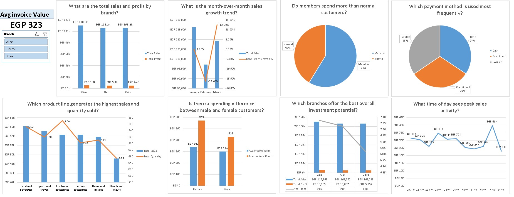

# 🛒 SuperMarket Sales Analysis — Interactive Excel Dashboard

> An end-to-end data analytics project built entirely in Excel — from raw data to an interactive, business-ready dashboard using **Power Query**, **Power Pivot**, and **DAX**.


---

## 📌 Project Overview

This project analyzes **1,000 sales transactions** from a supermarket chain operating across **three branches** (Alexandria, Cairo, and Giza) between **January and March 2019**. The goal is to transform raw, messy transactional data into a fully interactive dashboard that answers real business questions — the kind a manager or investor would actually ask.

The workbook follows a complete, professional analytics pipeline, not just a single chart thrown together:

```
📥 Raw Dataset → 🔍 Inspect → 🧹 Power Query → 🧼 Data Cleaning → 🗄️ Data Model
→ 📅 Date Table → 🧮 DAX Measures → ❓ Business Questions
→ 📊 PivotTables/Charts → 🖥️ Interactive Dashboard
```

---

## 🎯 Objectives

- Practice a **real-world BI workflow** end-to-end, not just isolated Excel formulas
- Turn a flat spreadsheet into a **relational data model** with proper relationships
- Write reusable, dynamic **DAX measures** instead of static formulas
- Answer **10 concrete business questions** using data, not assumptions
- Package everything into a **single-screen, filterable dashboard**

---

## 🗂️ Repository Structure

```
📦 SuperMarket-Sales-Dashboard
 ┣ 📊 Main_workbook.xlsx        # The full Excel file (data + model + dashboard)
 ┣ 🖼️ dashboard_preview.png     # Screenshot of the final dashboard
 ┣ 📄 README.md                 # You are here
 ┗ 📄 SuperMarket Analysis.csv  # The row data file before editing
```

Inside the workbook, you'll find 4 sheets:

| Sheet | Purpose |
|---|---|
| `SuperMarket Analysis Row` | Original, untouched raw dataset |
| `SuperMarket Analysis Table` | Cleaned & transformed data (via Power Query) |
| `Pivot Tables` | All working PivotTables/PivotCharts behind the scenes |
| `Dashboard` | The final interactive, presentation-ready dashboard |

---

## 🧹 Data Cleaning (Power Query)

Real datasets are never perfect — here's what was actually fixed:

- ✅ Verified **no missing values** and **no duplicate transactions** (1,000 unique Invoice IDs)
- ✅ Resolved a **Branch/City mismatch** in the source data (branch names didn't match their listed cities)
- ✅ Corrected the **Time column's data type** (was stored as plain decimal, not recognized as a proper time value)
- ✅ Removed a **redundant "gross margin percentage" column** — it was mathematically constant across every single row, so it added no analytical value
- ✅ Standardized text fields (trimmed whitespace, cleaned formatting)
- ✅ Added helper columns (`Month`, `Hour of Day`) for time-based analysis

---

## 🗄️ Data Model

Built a proper **star schema** in Power Pivot:

- **Fact Table:** `TABLE2` (cleaned transactions)
- **Dimension Table:** `Calendar` (auto-generated Date Table)
- **Relationship:** One-to-many between `Calendar[Date]` and `TABLE2[Date]`

This structure enables accurate **time intelligence** (like month-over-month growth) that a flat table alone can't support.

---

## 🧮 Key DAX Measures

| Measure | What it does |
|---|---|
| `Total Sales` | `SUM(TABLE2[Sales])` |
| `Total Profit` | `SUM(Sales) - SUM(cogs)` |
| `Avg Rating` | Average customer satisfaction score |
| `Transactions Count` | `COUNTROWS(TABLE2)` |
| `Avg Invoice Value` | `DIVIDE([Total Sales], [Transactions Count])` |
| `Sales Previous Month` | Uses `PREVIOUSMONTH()` time intelligence |
| `Sales MoM Growth %` | Month-over-month sales growth rate |
| `Member Sales` / `Normal Sales` | Sales filtered by customer type via `CALCULATE` |
| `Payment % of Total` | Uses `ALL()` to compute share of each payment method |
| `Branch Score` | Weighted composite score (sales + profit + rating) for ranking branches |

---

## ❓ Business Questions Answered

1. 💰 What are the total sales and profit by branch?
2. 🛍️ Which product line generates the highest sales and quantity sold?
3. 📈 What is the month-over-month sales growth trend?
4. 👥 Do members spend more than normal customers?
5. ⚖️ Is there a spending difference between male and female customers?
6. ⭐ What is the average customer rating by branch?
7. 💳 Which payment method is used most frequently?
8. 🕐 What time of day sees peak sales activity?
9. 🧾 What is the average invoice value per branch?
10. 🏆 Which branches offer the best overall investment potential?

---

## 💡 Key Insights

- 🏅 **Giza** has the highest branch score, combining strong sales, profit, and the best customer ratings
- 👤 **Members spend ~42% more** on average than non-member customers
- 🍔 **Food & Beverages** is the top-performing product line by both sales and quantity sold
- ⏰ Sales **peak around 7 PM**, suggesting evening hours drive the most revenue
- 💳 Payment methods are **almost evenly split** between Cash, Credit Card, and E-wallet — no single method dominates
- 📊 Profit margin is **structurally constant (~4.76%) across all dimensions** — a direct result of how tax is calculated in the dataset, not a real business signal. This was a key data-limitation insight discovered during analysis, not just a chart output.

---

## 🖥️ The Dashboard

The final dashboard is fully interactive:

- 🎛️ **Slicers** to filter by Branch, Product Line, Customer Type, Payment Method, and Date
- 📌 **KPI card** showing Average Invoice Value, filterable by branch
- 📊 A mix of column, line, and pie charts — each chosen deliberately based on what the data needed to show (not just picked at random)



---

## 🛠️ Tools & Skills Used

- **Excel** — core platform
- **Power Query** — data extraction, cleaning, and transformation
- **Power Pivot** — data modeling and relationships
- **DAX** — calculated columns and measures, including time intelligence
- **PivotTables / PivotCharts** — analysis and visualization
- **Dashboard design** — layout, KPI cards, slicers, visual hierarchy

---

## 📂 How to Use This File

1. Download `Main_workbook.xlsx`
2. Open it in **Microsoft Excel** (2016 or later recommended, for full Power Pivot support)
3. If prompted, click **Enable Content** to allow the Data Model to load
4. Go to the **Dashboard** sheet and use the slicers to explore the data interactively

---

## 👤 About Me

This is project #2 in my data analytics portfolio, built as part of my journey into data analysis using Excel's full BI toolkit. I'm actively building a portfolio of real, hands-on projects — feel free to connect or reach out with feedback!

🔗 *www.linkedin.com/in/fares-shaaban-279134434*
💼 *https://www.fiverr.com/users/fares_shaaban*

---

⭐ If you found this project useful or interesting, consider giving it a star!
